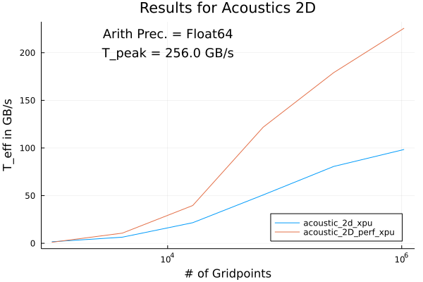
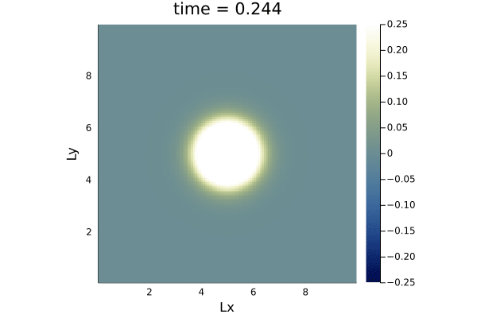
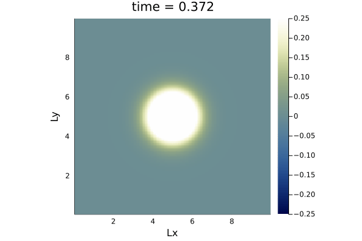

# Scaling Results

## Acoustics 2D

These are the Scaling test results done on a Nvidia Titan Xm GPU using 
Julia 1.6.3 on default Julia settings. The results were obtained by
generating the T_eff calculations using the script `scaling.jl` in the 
`acoustic_2D` folder, and then using the results to generate the above plot 
with `plot.jl` (in an interactive session, the scripts just prepare the
REPL). 

# Comment: Elastic Vs. Acoustic Wave propagation.

Comparing Elastic Wave propagation:

with Acoustic Wave propagation:

we can see that, using similar numeric and physical paramenters, with elastic
wave propagation, the wave travels in a more squarish shape, whereas 
with acoustic wave propagation, we can see that the wave travels in a more circular 
fashion. We also note that with elastic wave propagation, the wave travels more 
in a more concentrated form, whereas with acoustic wave propagation, the wave
travels in all direction as a wave front.  
