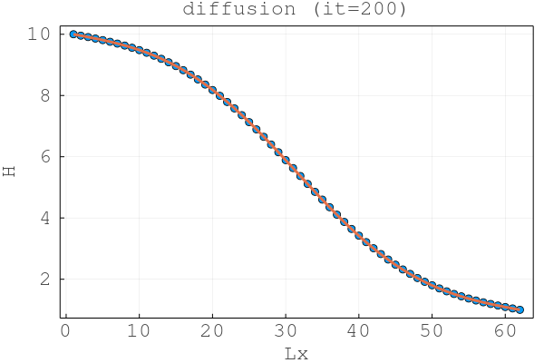
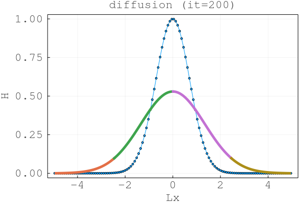
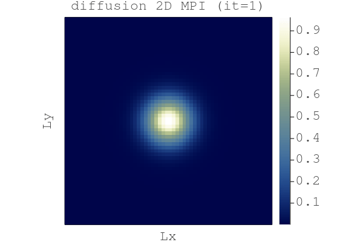
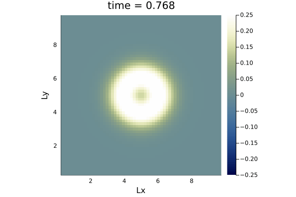
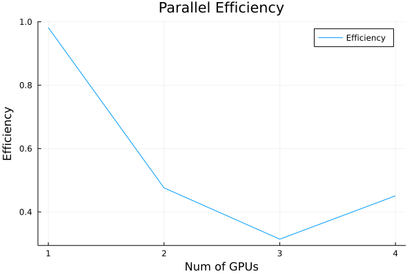
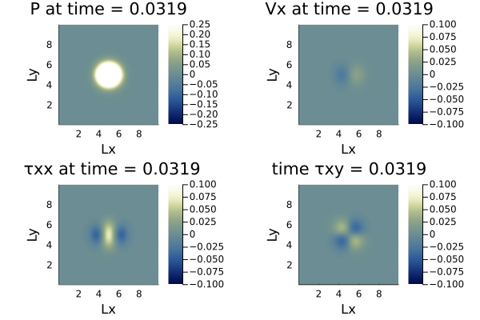

# Lecture 8: Readme

## Exercise 1 - Task 1
Here are the final distributions.

Here for *diffusion_1D_2procs*:



Here for *diffusion_1D_nprocs*:



## Exercise 1 - Task 2

After adapting the `vizme2D` script and the `diffusion_2D_mpi.jl` script,
we get the following GIF: 



The above GIF basically shows how the `diffusion_2D_mpi` script simulated 
the diffusion process of a certain material with the initial parameters as
defined in the `diffusion_2D_mpi.jl` script. 

The command used to run the script was:
```
~/.julia/bin/mpirunjl -n 4 julia --project diffusion_2D_mpi.jl
```

## Exercise 1 - Task 3


The above animation shows the vizualisation of the Concentration C, simulated by
the script `diffusion_2D_mpi_gpu.jl`. The simulation was done via MPI, on 4 Nvidia Titan XMp GPUs. We also note that the simulation does not look any different than the result
of Task 2

## Exercise 2 - Task 2

After adapting the `acoustic_2D_perf_xpu.jl` to be a multi-xpu script, the script
generated the following gif:



## Exercise 2 - Task 3

Now, we do a weak scaling experiment with `acoustic_2D_perf_multixpu.jl`
with local grid side `nx, ny = 1024, 1024`. The base time for this
script run was: 
```julia
base_time = 1.9346991
```
Now, we get the following Parallel efficiency results:



We note that with more GPU's, the parallel efficiency actually goes down, except with 4
GPUs, as there we see a trend reversal. This might be because with 2 and 3 GPUs, the 
implicit global grid is sized in such a way that even with the @hide_communication macro,
we do not do enough to compensate for the time used to exchange the boundary values of 
the implicit grid. However, for the 4 GPU case, we do actually see an improvement, because
we now do more work during the bounday copy and thereby waste less time.

## Exercise 3 - Task 2

When executing the Script `viscous_NS_2D.jl`, we get the following animation as a result:



This animation shows pressure P, x-component of the velocity, and the 
xx and xy shear tensor components. 